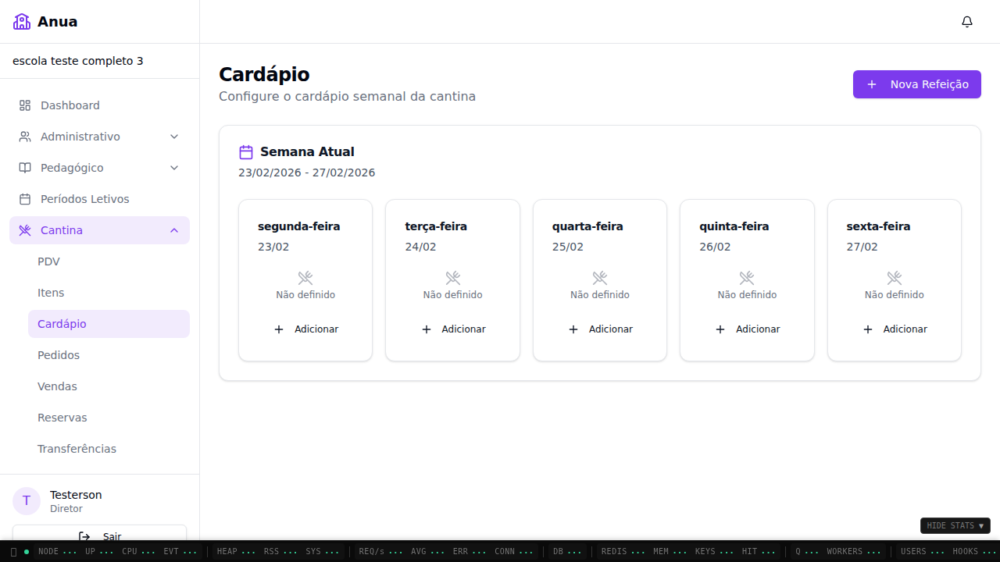
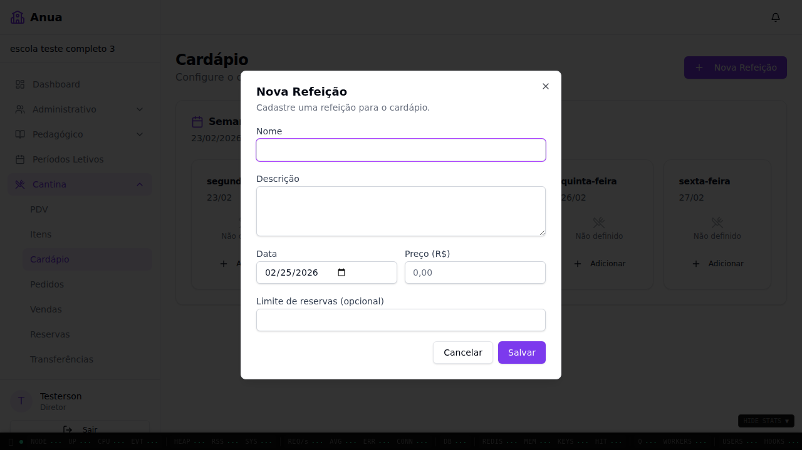
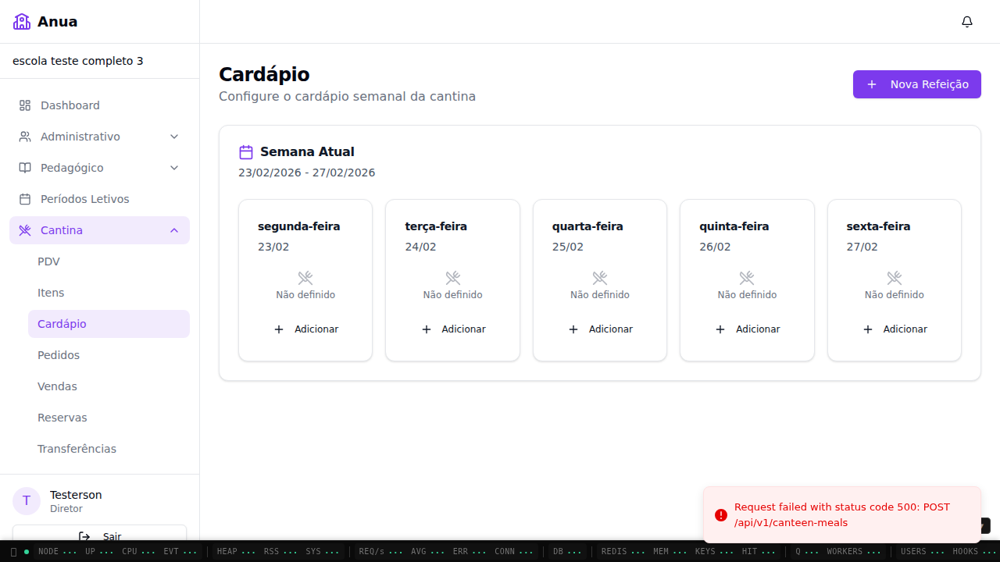
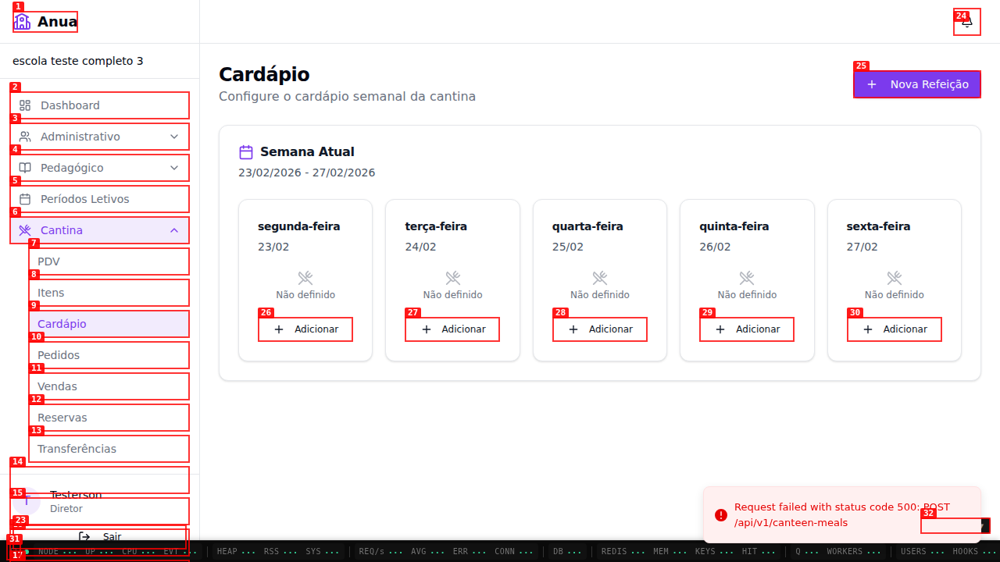
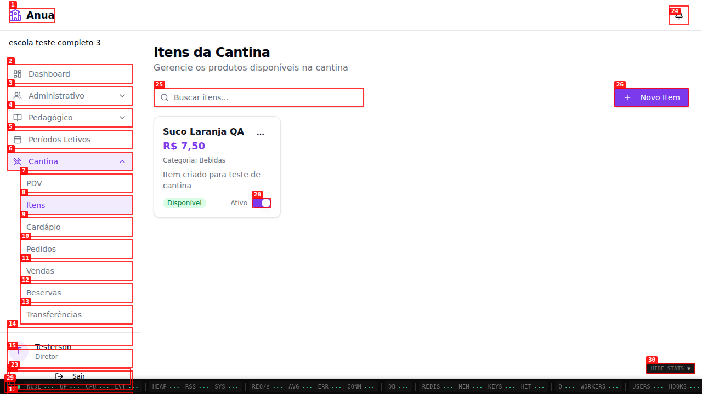

# Dogfood Report: Anua - Cantina Escola

| Field       | Value                                                                                       |
| ----------- | ------------------------------------------------------------------------------------------- |
| **Date**    | 2026-02-25                                                                                  |
| **App URL** | http://localhost:43195                                                                      |
| **Session** | cantina-escola-019be8e0-v2                                                                  |
| **Scope**   | Fluxos de cantina em `/escola` com diretor da escola `019be8e0-590f-70bf-894b-fb7ccc036bfc` |

## Summary

| Severity  | Count |
| --------- | ----- |
| Critical  | 0     |
| High      | 0     |
| Medium    | 1     |
| Low       | 1     |
| **Total** | **2** |

## Issues

### ISSUE-001: Refeição criada no Cardápio não aparece na grade semanal

| Field           | Value                                          |
| --------------- | ---------------------------------------------- |
| **Severity**    | medium                                         |
| **Category**    | functional                                     |
| **URL**         | http://localhost:43195/escola/cantina/cardapio |
| **Repro Video** | `videos/issue-001-repro.webm`                  |

**Description**

Ao criar uma refeição com sucesso pelo modal de `Cardápio`, a grade semanal continua mostrando apenas botões `Adicionar` e não renderiza o item criado. O esperado é exibir a refeição recém-criada no dia correspondente (com ações de editar/excluir). O comportamento atual impede a gestão visual do cardápio após criação.

**Repro Steps**

1. Acesse `http://localhost:43195/escola/cantina/cardapio`.
   

2. Clique em `Nova Refeição` para abrir o modal de criação.
   

3. Preencha nome/data/preço e salve.
   

4. **Observe:** a grade semanal segue sem a refeição criada (somente `Adicionar`).
   

---

### ISSUE-002: Erro de hydration no carregamento da página de Itens

| Field           | Value                                       |
| --------------- | ------------------------------------------- |
| **Severity**    | low                                         |
| **Category**    | console                                     |
| **URL**         | http://localhost:43195/escola/cantina/itens |
| **Repro Video** | N/A                                         |

**Description**

Ao abrir a tela de itens da cantina, o console registra `Hydration failed because the server rendered HTML didn't match the client`. Embora a página renderize, esse erro indica inconsistência SSR/CSR e pode causar re-render inesperado, flicker e instabilidade em produção.

**Evidence**

1. Acesse `http://localhost:43195/escola/cantina/itens` e observe o console do browser.
   

---
