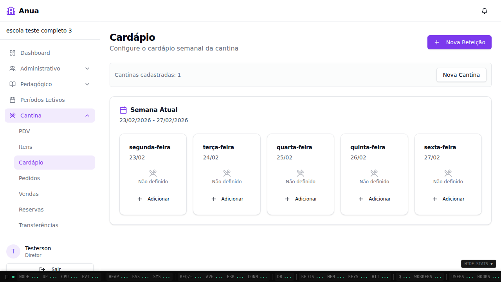
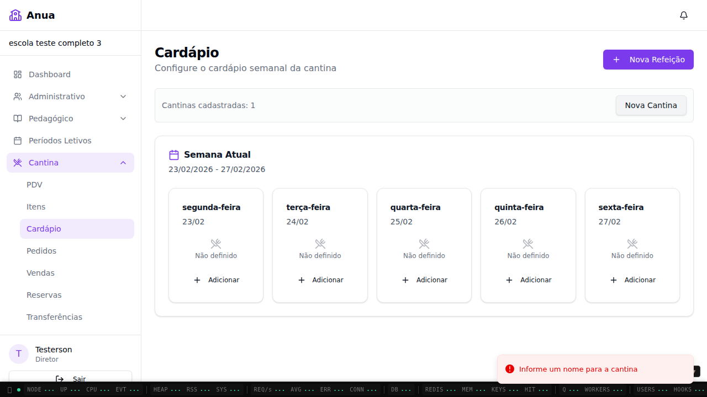
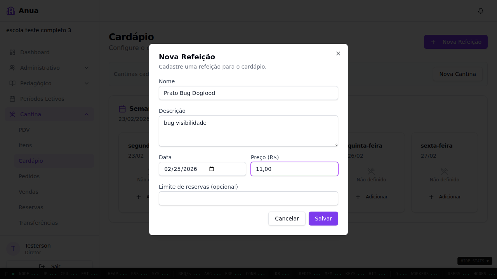
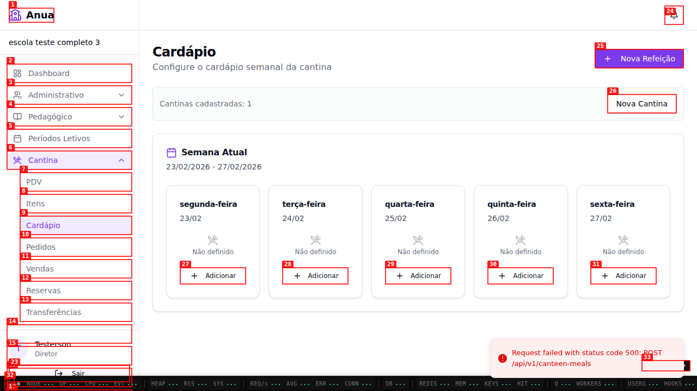
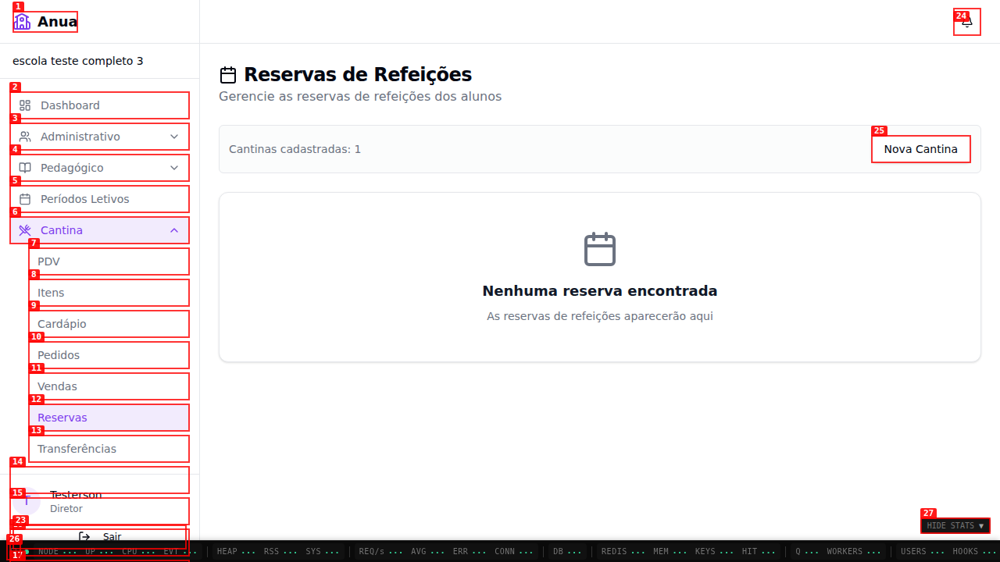

# Dogfood Report: Cantina Escola/Responsavel

| Field       | Value                                                            |
| ----------- | ---------------------------------------------------------------- |
| **Date**    | 2026-02-25                                                       |
| **App URL** | `http://localhost:43195`                                         |
| **Session** | `cantina-final` + `cantina-resp`                                 |
| **Scope**   | Fluxos cantina em `/escola/*` (diretor) e `/responsavel/cantina` |

## Summary

| Severity  | Count |
| --------- | ----- |
| Critical  | 0     |
| High      | 0     |
| Medium    | 2     |
| Low       | 1     |
| **Total** | **3** |

## What Was Tested

- Login OTP como diretor e como responsável
- `/escola/cantina/itens`: listagem + criação de item
- `/escola/cantina/cardapio`: criação de refeição
- `/escola/cantina/pdv`: venda com aluno selecionado
- `/escola/cantina/pedidos`, `/vendas`, `/reservas`, `/transferencias`
- `/responsavel/cantina`

## Issues

### ISSUE-001: Refeição criada no Cardápio não aparece na grade semanal

| Field           | Value                                            |
| --------------- | ------------------------------------------------ |
| **Severity**    | medium                                           |
| **Category**    | functional                                       |
| **URL**         | `http://localhost:43195/escola/cantina/cardapio` |
| **Repro Video** | `videos/issue-001-repro.webm`                    |

**Description**

Ao criar refeição no modal, o fluxo retorna para a página, mas a grade semanal continua sem mostrar o item (permanece apenas com botões `Adicionar`). Isso impede a gestão do cardápio após cadastro.

**Repro Steps**

1. Abra `http://localhost:43195/escola/cantina/cardapio`.
   
2. Clique em `Nova Refeição`.
   
3. Preencha nome/data/preço e salve.
   
4. Resultado: refeição não aparece na grade semanal.
   

---

### ISSUE-002: Página de Reservas da cantina renderiza sem conteúdo útil (apenas shell)

| Field           | Value                                            |
| --------------- | ------------------------------------------------ |
| **Severity**    | medium                                           |
| **Category**    | functional                                       |
| **URL**         | `http://localhost:43195/escola/cantina/reservas` |
| **Repro Video** | N/A                                              |

**Description**

A tela abre com layout e menu, mas sem tabela, sem empty-state e sem mensagem de erro para o usuário. No console, houve falhas `500` durante navegação para páginas de cantina relacionadas.

**Evidence**

---

### ISSUE-003: Página de Transferências da cantina renderiza sem conteúdo útil (apenas shell)

| Field           | Value                                                  |
| --------------- | ------------------------------------------------------ |
| **Severity**    | low                                                    |
| **Category**    | functional/ux                                          |
| **URL**         | `http://localhost:43195/escola/cantina/transferencias` |
| **Repro Video** | N/A                                                    |

**Description**

A tela carrega o cabeçalho/menu, porém não mostra tabela, empty-state ou feedback de erro. Para o usuário final, parece página quebrada sem explicação.

**Evidence**

