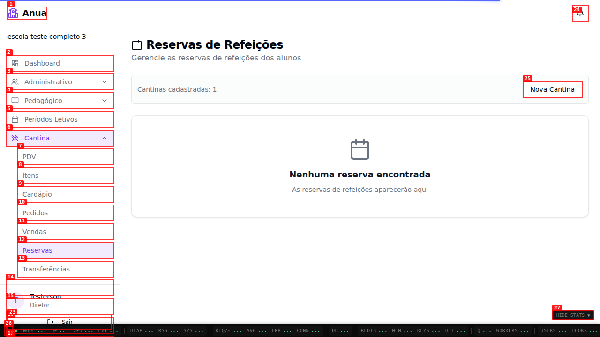
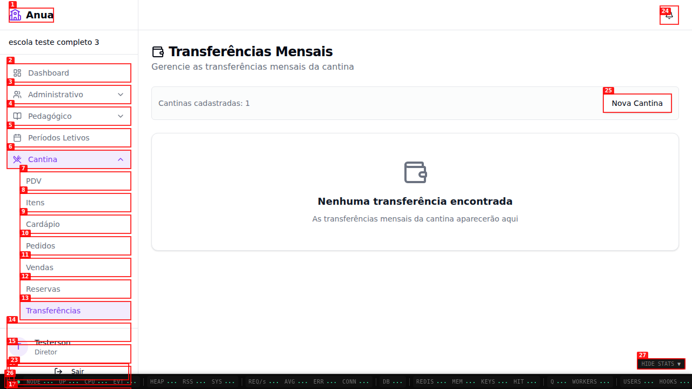

# Dogfood Report: Anua Cantina (Rerun)

| Field       | Value                                                                                                                          |
| ----------- | ------------------------------------------------------------------------------------------------------------------------------ |
| **Date**    | 2026-02-25                                                                                                                     |
| **App URL** | http://localhost:43195                                                                                                         |
| **Session** | cantina-rerun                                                                                                                  |
| **Scope**   | Revalidacao das telas `/escola/cantina/cardapio`, `/escola/cantina/reservas` e `/escola/cantina/transferencias` apos correcoes |

## Summary

| Severity  | Count |
| --------- | ----- |
| Critical  | 0     |
| High      | 0     |
| Medium    | 0     |
| Low       | 1     |
| **Total** | **1** |

## Notes

- Revalidacao confirmou que refeicoes criadas agora aparecem no cardapio semanal.
- Revalidacao confirmou que Reservas e Transferencias exibem estado vazio informativo (nao tela em branco).
- Revalidacao confirmou que o botao **Nova Cantina** agora abre dialog de criacao.
- Revalidacao confirmou que os botoes de editar/excluir refeicao agora possuem rotulo acessivel.
- Revalidacao confirmou upload de imagem em item da cantina:
  - item criado com imagem renderizada no card,
  - item criado sem imagem continua com fallback visual,
  - remocao de imagem via update (`removeImage=true`) funcionando e refletindo no DTO.
- Evidencia: `screenshots/final-canteen-item-image-upload.png`.

## Fixed In This Rerun

### ISSUE-001 (anterior): Botao "Nova Cantina" nao executava nenhuma acao

- **Status:** Resolvido
- **Evidencia:**
  - `screenshots/final-nova-cantina-result.png` (dialog aberto com campo Nome e acao Criar cantina)
  - `videos/final-nova-cantina-ok.webm`

### ISSUE-002 (anterior): Botoes sem rotulo acessivel no cardapio semanal

- **Status:** Resolvido
- **Evidencia:**
  - `screenshots/final-cardapio.png` (snapshot anotado mostra botoes nomeados: "Editar refeicao ..." e "Excluir refeicao ...")

## Issues

### ISSUE-003: Hydration mismatch no console ao navegar entre paginas da cantina

| Field           | Value                                                |
| --------------- | ---------------------------------------------------- |
| **Severity**    | low                                                  |
| **Category**    | console                                              |
| **URL**         | http://localhost:43195/escola/cantina/transferencias |
| **Repro Video** | N/A                                                  |

**Description**

Durante a navegacao entre telas da cantina, o console registra erro de hidratacao React: `Hydration failed because the server rendered HTML didn't match the client`. Nao bloqueou os fluxos principais validados, mas indica inconsistencias SSR/CSR que podem causar recarregamento parcial da arvore no cliente.

**Repro Steps**

1. Acesse `http://localhost:43195/escola/cantina/cardapio`.
2. Navegue para `Reservas` e depois `Transferencias`.
   
   

3. **Observe no console:** mensagem de hydration mismatch aparece nas transicoes.
